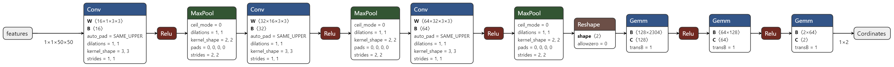
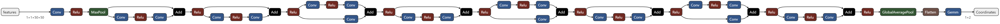
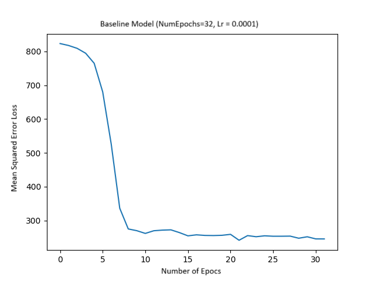
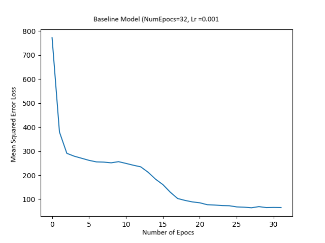
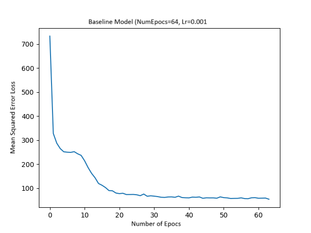
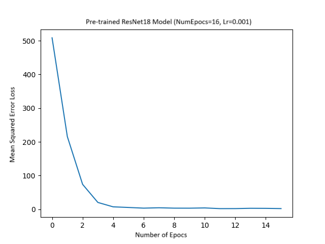
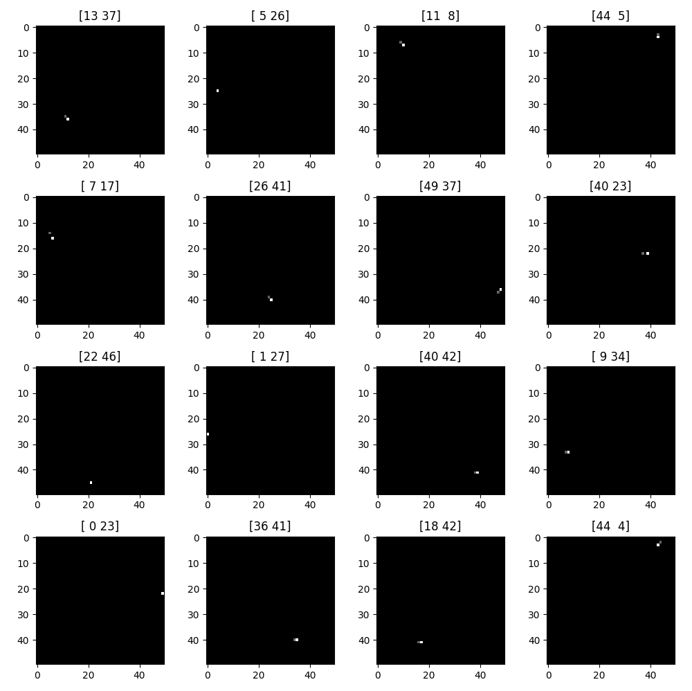

# Assignment
The Problem Statement:\
Using Deep Learning techniques, predict the coordinates (x,y) of a pixel which has a value of
255 for 1 pixel in a given 50x50 pixel grayscale image and all other pixels are 0. The pixel with a
value of 255 is randomly assigned. You may generate a dataset as required for solving the
problem. Please explain your rationale behind dataset choices.

## Installation
1. Clone the repository:
```
git clone https://github.com/morancium/Assignment.git
```
2. Navigate to the project directory:
``` 
cd Assignment
```
3. Create a virtual environment (recommended) and install the required dependencies:
```
python3 -m venv venv
source venv/bin/activate  # Activate virtual environment (Linux/macOS)
pip install -r requirements.txt  # Install dependencies
```

## Usage

- **config.py**\
Here all the important variables, Hyperparameters, and Paths are stored so that they can be used in the code easily.

- **Dataset.py**\
The Script contains the code to generate the dataset and save it.

- **utils.py** \
This script has two classes, namely: `Utils` and `Data`\
    > `Utils`\
    > This class provides utility functions for the following tasks: 
    > - Visualization:\
       Visualizes the model's output and ground truth labels on a 4x4 grid. The label will be displayed in white pixel, and the output will be displayed in gray pixel along with the plot title as the Label cordinates
    > - Checkpoint saving:\
        It saves the model and optimizer state dictionaries to a checkpoint file.
    > - Plot Image and Plot Images:\
        Both are used to plot the image or an array of Images only with single label may it be the output or ground truth label
    
    > `Data`  
    > This class represents a custom dataset for loading images and labels.
    > It inherits from the `Dataset` class and provides methods for accessing images
    and their corresponding labels based on their paths.

- **model.py**  
This is Where the baseline model resides.  
The following image is a summary of the model
  
It consists of 3 CNN layers each having ReLu activation function and a Maxpool layer followed by 2 Fully connected layers each followed by a Dropout layer and the final layer predicting the coordinates

- **train.py**  
This is where we train our baseline model  
Used the following Model Hyperparameters:  
    > - Batch Size == 128  
    > - Learning Rate == 0.001
    > - Number of Epochs == 64
    > - The loss Function is Mean Squared Error Function
    > - And used Adam Optimizer as the optimizer  

    Save the weights using the Utils class and finally visualizing the loss graph  
    [-] Note: The following Hyperparameters are the best parameters I found after testing different combinations of them.

- **pre_trained_resnet18.py**  
This is where we import the pre-trained Resnet18 model.  
Here we Fine-tune the model as well as test the final model after the training is done.  
The following image is a summary of the model
  
Added a CNN layer to adjust the input of the model and also added a final layer to give only two nodes for predicting coordinates.
Used the following Model Hyperparameters:  
    > - Batch Size == 128  
    > - Learning Rate == 0.001
    > - Number of Epochs == 16
    > - The loss Function is Mean Squared Error Function
    > - And used Adam Optimizer as the optimizer  

    Finally tested and saved the model and visualized the results with a Graph.

- **test.py**  
This script contains the code to test and load the trained model on the test dataset which has been created separately from the training dataset, and also visualizing the outputs.


## Results
The graphs of the Loss function of the baseline model with different combinations of Epochs and Learning rate  

Baseline model with the Learning rate of 0.0001 and with 32 epochs  
>   

Baseline model with the Learning rate of 0.001 and with 32 epochs  
>   

Baseline model with the Learning rate of 0.001 and with 64 epochs 
>   

Pre Trained ResNet18 model with the Learning rate of 0.001 and with 16 epochs [**BEST**]
>   

Here are the Visualization of the predictions of the best baseline model and pre-trained resnet18 model  
The title of each plot it the label coordinate which is displayed in white pixel, and the output is displayed in gray pixel.  

Baseline model: 


Pre-trained ResNet18 model:


## Conclusions
On increasing the learning rate in the baseline model helps to converge the model faster and increasing the number of epochs reduces the loss.  
Definitely, the Pretrained model outperformed the baseline model by a huge margin    
One thing I want to point out is that the dataset combinations are very limited (well, 2500 to be precise) so here there is a chance that the model might overfit the dataset.

## Future Work and Other Ideas
I thought we might incorporate a YOLO model for this task. Labels might be the bounding boxes with the center as the label coordinate of the pixel. But I think till will be an overkill for this easy task.  
The other approach I thought of was using a core machine learning model like an SVM for this regression task.

## Important Links:
[Dataset Link](https://drive.google.com/file/d/1L5O--bGABt_Hy_PIzKbfbE02f0tdhKlv/view?usp=sharing)  
[Test Dataset Link](https://drive.google.com/file/d/1HzlQ9N_lGAqnhQYXXctLBTJ3LhrDhogy/view?usp=sharing)  
[Baseline Model Weights](https://drive.google.com/file/d/16KJ1F3eHFj2YUfZs9eWD5cq4Sb9U_qiU/view?usp=drive_link)  
[Pretrained ResNet18 Weights](https://drive.google.com/file/d/1gw_PLAZ-iT9SK_66PQxC_JPGuWO1Ndxe/view?usp=drive_link)